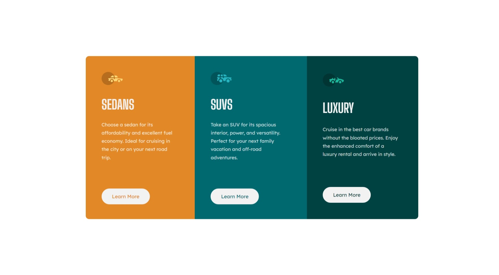

# Frontend Mentor - 3-column preview card component solution

This is a solution to the [3-column preview card component challenge on Frontend Mentor](https://www.frontendmentor.io/challenges/3column-preview-card-component-pH92eAR2-). Frontend Mentor challenges help you improve your coding skills by building realistic projects.

## Table of contents

- [Overview](#overview)
  - [The challenge](#the-challenge)
  - [Screenshot](#screenshot)
  - [Links](#links)
- [My process](#my-process)
  - [Built with](#built-with)
  - [What I learned](#what-i-learned)
- [Author](#author)

## Overview

### The challenge

Users should be able to:

- View the optimal layout depending on their device's screen size
- See hover states for interactive elements

### Screenshot



### Links

- Solution URL: [Add solution URL here](https://your-solution-url.com)
- Live Site URL: [Add live site URL here](https://your-live-site-url.com)

## My process

### Built with

- jsx
- CSS custom properties
- Flexbox
- Mobile-first workflow
- [React](https://reactjs.org/) - JS library
- [Sass](https://sass-lang.com/) - CSS preprocessor
- [vite](https://vitejs.dev/) - Build tool

### What I learned

```js
const [backgroundColor, setBackgroundColor] = useState(veryLightGray);
const [fontColor, setFontColor] = useState(bgColor);

const handleMouseOver = () => {
  setBackgroundColor(bgColor);
  setFontColor(veryLightGray);
};

const handleMouseOut = () => {
  setFontColor(bgColor);
  setBackgroundColor(veryLightGray);
};
//also to change css with js event
e.target.style.backgroundColor = "red";
```

## Author

- Frontend Mentor - [@DagimTizazu](https://www.frontendmentor.io/profile/DagimTizazu)
- Email address - dagimtizazu4444@gmail.com
- Telegram - @dag400
